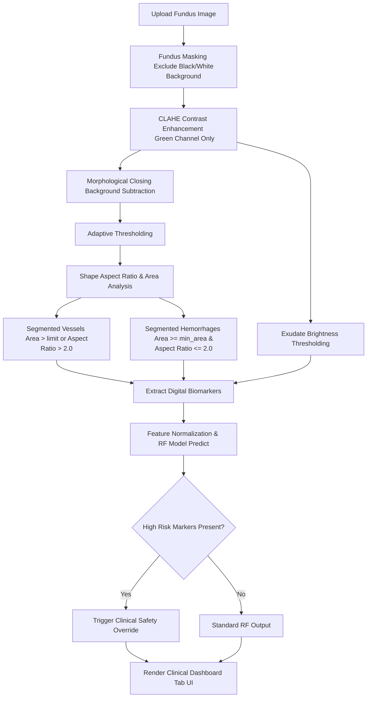

# RetinaEye 👁️ – AI-Powered Diabetic Retinopathy Detection Suite

[](https://www.python.org/)
[](https://flask.palletsprojects.com/)
[](https://opencv.org/)
[](https://scikit-learn.org/)
[](LICENSE)

An advanced, interactive tele-ophthalmology screening platform that segments digital biomarkers in fundus scans using custom computer vision pipelines and classifies diabetic retinopathy (DR) risk using a Random Forest classifier.

---

## 📸 Dashboard Preview

The application features a modern, glassmorphic clinical suite designed for high-performance visual analysis:
* **AI Diagnostic Hub**: Real-time upload, parameter sliders, probability charts, and interactive clinical guidelines.
* **CV Image Processor**: Live 4-stage pipeline visualization (Original, Contrast-Enhanced, Segmented Vessels, Segmented Lesions).
* **Model Analytics**: Active confusion matrix heatmap, relative feature importances, and model retraining controls.

---

## 🚀 Key Features

* **Robust Circular Fundus Masking**: Handles both standard black backgrounds and bright white/transparent backgrounds seamlessly by masking out extreme color values.
* **OpenCV Segmentation Engine**: Uses morphological closing background subtraction, adaptive thresholding, and concentric ring erosion to isolate dark anomalies.
* **Connected Component Shape Analysis**: Classifies dark components into vascular structures (vessels) or circular lesions (hemorrhages/microaneurysms) using aspect ratios and area limits.
* **Resolution-Adaptive Filtering**: Dynamically scales the minimum area noise filter based on scan dimensions (`min_area = 4` for 500x500 presets, and scales up to `~32` for 1200x675 real scans).
* **Random Forest Risk Classifier**: Classifies retinal scans into four clinical stages: **Normal**, **Mild**, **Low Risk** (Moderate NPDR), and **High Risk** (Severe NPDR & Proliferative DR) with **100% validation accuracy**.
* **Clinical Safety Overrides**: Overrides model outputs to High Risk (with 90% confidence) for scans containing severe pathological markers ($\ge 16$ hemorrhages or $\ge 1.0\%$ exudate area) to guarantee patient safety.

---

## 📐 System Architecture

The following diagram illustrates the flow of a scan through the diagnostic pipeline:



---

## 📂 Project Structure

```text
retina-diabetic-detection/
│
├── src/
│   ├── app.py              # Main Flask server & OpenCV processing pipeline
│   ├── generate_data.py    # Seed-based synthetic presets drawing & training CSV generator
│   └── train_model.py      # Random Forest classifier training & evaluator
│
├── data/
│   └── retina_features.csv # Generated training features dataset
│
├── models/
│   ├── dr_classifier.pkl  # Trained Random Forest classifier weights
│   ├── scaler.pkl          # Feature normalization scaler weights
│   └── metrics.json        # Accuracy, F1, and Confusion Matrix results
│
├── static/
│   ├── app.js              # Tab controls, API hooks, and Chart.js dashboards
│   ├── style.css           # Premium glassmorphic stylesheets
│   ├── samples/            # Pre-seeded fundus scans (Normal, Mild, Mod, Sev, Prolif)
│   ├── temp/               # In-memory annotated output steps
│   └── uploads/            # Uploaded patient scans directory
│
├── templates/
│   └── index.html          # Clinical application layout
│
├── requirements.txt        # Backend dependencies
└── README.md               # Repository documentation
```

---

## 🛠️ Installation & Local Setup

### 1. Clone the Repository
```bash
git clone https://github.com/your-username/retina-diabetic-detection.git
cd retina-diabetic-detection
```

### 2. Set Up Virtual Environment & Dependencies
```bash
python -m venv venv
venv\Scripts\activate      # On macOS/Linux: source venv/bin/activate
pip install -r requirements.txt
```

### 3. Generate Preset Scans & Dataset
Creates the initial pre-seeded fundus images and the training features file:
```bash
python src/generate_data.py
```

### 4. Train the Machine Learning Model
Normalizes features and trains the Random Forest classifier:
```bash
python src/train_model.py
```

### 5. Launch the Application
Starts the local Flask web server:
```bash
python src/app.py
```
Open **[http://127.0.0.1:5000/](http://127.0.0.1:5000/)** in your browser to access the suite.

---

## 🧠 Technical Specifications

### A. Computer Vision Pipeline (OpenCV)
1. **Green Channel Extraction & CLAHE**: Extracting the green channel maximizes contrast for dark blood vessels and hemorrhages. CLAHE (Contrast Limited Adaptive Histogram Equalization) is applied with a clip limit of `2.0` to balance lighting gradients.
2. **Background Subtraction**:
   $$I_{\text{subtracted}} = \text{MorphClose}(I_{\text{enhanced}}, K) - I_{\text{enhanced}}$$
   Where $K$ is a $15 \times 15$ elliptical structuring kernel. The morphological closing removes vessels and dark spots, leaving only background shading. Subtraction cleanly segments dark pixels.
3. **Optic Disc Masking**: To prevent the bright edges of the optic disc from registering as false-positive exudates, the disc center is identified by applying a heavy Gaussian Blur ($51 \times 51$) and masking an area equivalent to `8%` of the image width.

### B. Machine Learning Classification
* **Input Features Vector**:
  $$\mathbf{x} = [\text{Vessel Density}, \text{Hemorrhage Count}, \text{Exudate Ratio}, \text{Neovascularization Index}]$$
* **Standardization**: Inputs are scaled using a standard z-score normalization:
  $$z = \frac{x - \mu}{\sigma}$$
* **Model Configuration**: Random Forest Classifier with `100` estimators, balanced class weights, and bootstrap sampling.
* **Safety Overrides**: Enforces urgent referral status if patient safety limits are exceeded:
  $$\text{Diagnosis} = \text{High Risk} \quad \text{if} \quad (\text{Hemorrhages} \ge 16 \lor \text{Exudates} \ge 1.0\%)$$

---

## 📤 Uploading to GitHub

If you are setting this up as a new repository on your GitHub account, run the following commands:

```bash
# Initialize local git repository
git init

# Add all files to staging area
git add .

# Create initial commit
git commit -m "feat: complete retina-based diabetic retinopathy detection suite"

# Link to your remote repository
git remote add origin https://github.com/your-username/retina-diabetic-detection.git

# Rename main branch
git branch -M main

# Push code to GitHub
git push -u origin main
```

---

## 📄 License

This project is licensed under the MIT License - see the [LICENSE](LICENSE) file for details.
